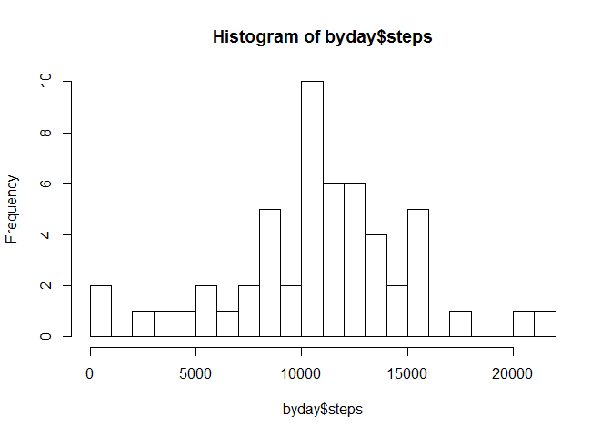
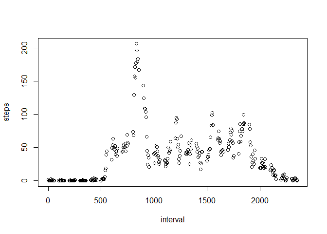
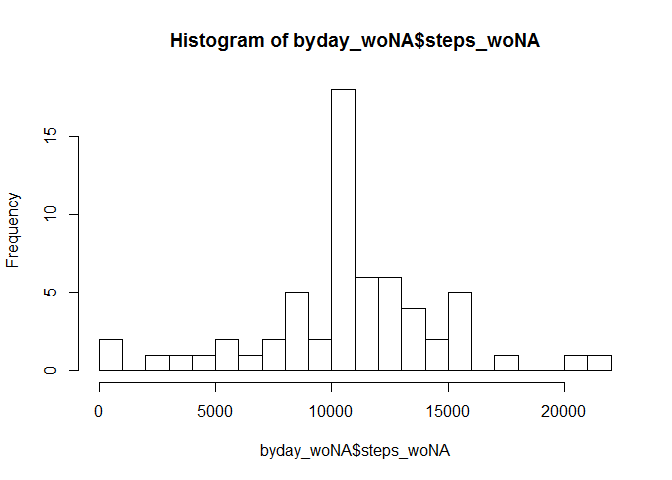
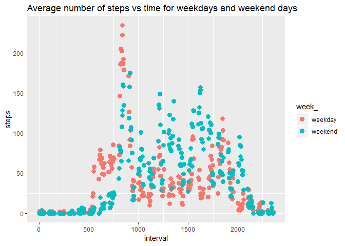

## Introduction

It is now possible to collect a large amount of data about personal movement using activity monitoring devices such as a Fitbit, Nike Fuelband, or Jawbone Up. These type of devices are part of the "quantified self" movement - a group of enthusiasts who take measurements about themselves regularly to improve their health, to find patterns in their behavior, or because they are tech geeks. But these data remain under-utilized both because the raw data are hard to obtain and there is a lack of statistical methods and software for processing and interpreting the data.

This assignment makes use of data from a personal activity monitoring device. This device collects data at 5 minute intervals through out the day. The data consists of two months of data from an anonymous individual collected during the months of October and November, 2012 and include the number of steps taken in 5 minute intervals each day.

The variables included in this dataset are:  
    - steps: Number of steps taking in a 5-minute interval (missing values are coded as NA)  
    - date: The date on which the measurement was taken in YYYY-MM-DD format  
    - interval: Identifier for the 5-minute interval in which measurement was taken  

The dataset is stored in a comma-separated-value (CSV) file and there are a total of 17,568 observations in this dataset.

## Libraries recquired to run code below


```r
library('ggplot2')
library("dplyr")
```


## Loading and preprocessing the data


```r
data <- read.table('./activity/activity.csv',header=T,sep=',')
```


## What is mean total number of steps taken per day?

The total number of steps per date is calculated with the R fucntion 'aggregate' used to apply the 'sum' function for each date.


```r
# Calculate the total number of steps per day
byday <- aggregate(steps~date,data=data,FUN=sum)
hist(byday$steps,breaks=20)
```

<!-- -->

```r
# Mean and median value
mean(byday$steps)
```

```
## [1] 10766.19
```

```r
median(byday$steps)
```

```
## [1] 10765
```


## What is the average daily activity pattern?

The average number of steps per interval is calculated with the R fucntion 'aggregate' used to apply the 'mean' function to each interval.


```r
# Calculate the average number of steps per interval
by5minint <- aggregate(steps~interval,data=data,FUN=mean)

# Plot average time serie
with(by5minint,plot(interval,steps))
```

<!-- -->

The interval with the maximum average number of steps is calculated as follows:


```r
# Get the interval where the maximum number of steps is observed
maxsteps <- max(by5minint$steps, na.rm = FALSE)
by5minint$interval[which(by5minint$steps==maxsteps)]
```

```
## [1] 835
```


## Imputing missing values

The number of NA is first calcualted.
Then, all NA are replaced by the number of steps at teh same interval (averaged over all days).


```r
# Number of NA in the data
sum(is.na(data$steps))
```

```
## [1] 2304
```

```r
# Replace NA value per the average number of steps for each interval
data$steps_5minavg <- rep(by5minint$steps,61)
data$steps_woNA <- ifelse(is.na(data$steps),data$steps_5minavg,data$steps)
```

Then, the values calculated previously are again calculated without NA:


```r
# Calculate the average number of steps per interval
byday_woNA <- aggregate(steps_woNA~date,data=data,FUN=sum)
hist(byday_woNA$steps_woNA,breaks=20)
```

<!-- -->

```r
# Mean and median value after removing the NA
mean(byday_woNA$steps_woNA)
```

```
## [1] 10766.19
```

```r
median(byday_woNA$steps_woNA)
```

```
## [1] 10766.19
```


## Are there differences in activity patterns between weekdays and weekends?

The data are first discriminated between week days and weekend days.
Then, the average per interval is calcualted for week days and weekend days.


```r
# Get days and discriminate between weekend and weekdays
data$day <- weekdays(as.Date(data$date))
data$week_ <- as.factor(ifelse(
                    data$day == 'Saturday' | data$day == 'Sunday',
                    'weekend',
                    'weekday'))

# Calculate the average number of steps per interval and for weekend/days
by5minint <- aggregate(steps~interval+week_,data=data,FUN=mean)

# Plot the data
p <- qplot(interval,steps,data=by5minint,color=week_)
p + geom_point(size = 3) + ggtitle('Average number of steps vs time for weekdays and weekend days')
```

<!-- -->

The plot shows that the activity is higher between 5am and 8am during the week while it is higher in the afternoon and the evening during the week end.


